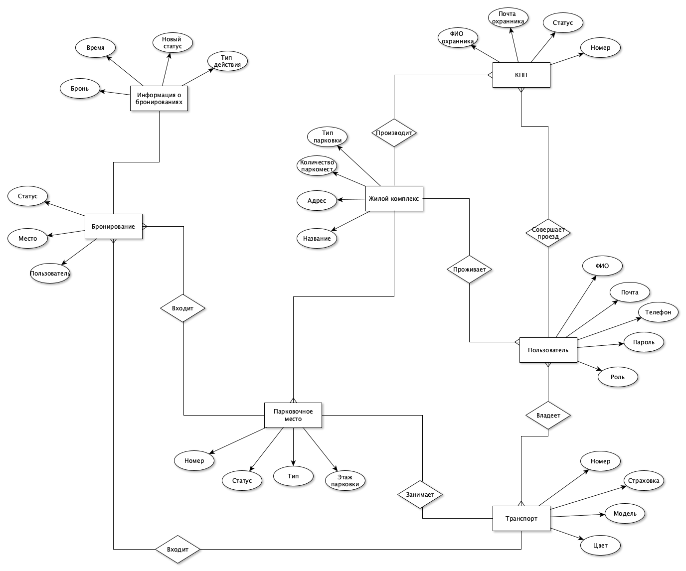
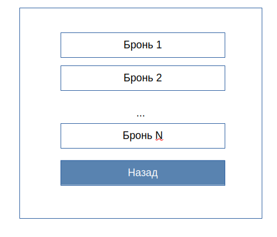

# Система управления паркингом ЖК (платная, бесплатная, несколько выездов)

## Описание проекта
"Система управления паркингом ЖК" — это программное решение для автоматизированного контроля и управления парковочными местами в жилом комплексе. Система позволяет жителям бронировать парковочные места, отслеживать их занятость и управлять оплатой. Поддерживаются как платные, так и бесплатные зоны парковки, а также наличие нескольких выездов.

## Описание предметной области
Парковка в жилых комплексах часто сталкивается с проблемами недостатка мест, несанкционированной парковки и отсутствия удобного способа управления распределением мест между жильцами. Автоматизированная система позволяет эффективно контролировать использование парковочного пространства, обеспечивать удобный доступ и исключать использование парковки посторонними лицами. Возможность учета нескольких выездов повышает гибкость системы.

## Актуальность проекта
С увеличением числа автомобилей и ограниченными парковочными местами в жилых комплексах необходимо эффективное управление этим ресурсом. Система управления паркингом для ЖК позволяет жильцам удобно резервировать места, предотвращает несанкционированную парковку и упрощает контроль для администрации комплекса. Поддержка платной и бесплатной парковки делает систему более гибкой, а возможность учета нескольких выездов обеспечивает удобство передвижения. Это решение улучшает комфорт проживания и снижает конфликты между жильцами.

## Описание акторов
- **Житель ЖК** – использует систему для поиска, бронирования и оплаты парковочного места.
- **Администратор ЖК** – управляет парковочным пространством, следит за доступностью мест и ведет учет пользователей.
- **Гость** – использует систему для проезда через КПП того ЖК, в котором его авторизовал житель.
- **Контрольный пункт выезда** – автоматизированная система, регулирующая выезд транспорта в зависимости от его допуска.

## Функциональные требования
- добавление новых пользователей и транспортных средств;
- регистрация бронирований;
- фиксация событий въезда/выезда;
- возможность временного пропуска для гостя.

## Use-Case - диаграмма

## ER-диаграмма сущностей

## Диаграмма БД

## BPMN-диаграммы
### Бронирование парковочного места

### Проезд через КПП

### Добавление в список гостей

## Технологический стек
- ЯП Kotlin
- система сборки Gradle
- СУБД PostgreSQL
- Web: html + css, React

## Верхнеуровневое разбиение на компоненты

## Диаграмма классов

## Будущие экраны приложения

### Экран входа

### Экран регистрации

### Экран бронирования для жильца

### Экран добавления гостя

### Экран гостя

### Экраны админа

